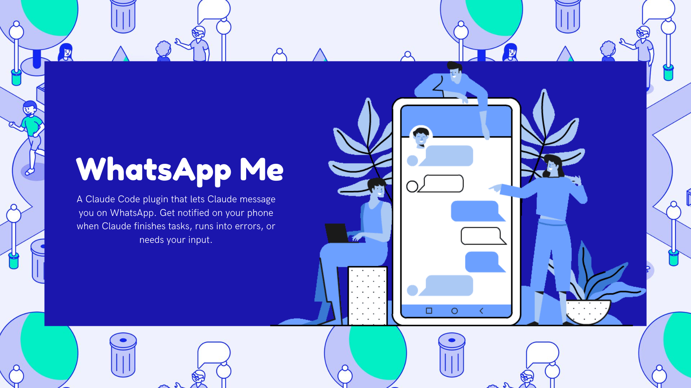

# WhatsApp-Me

A Claude Code plugin that lets Claude message you on WhatsApp. Get notified on your phone when Claude finishes tasks, runs into errors, or needs your input.



## Features

- 📱 **Two-way messaging** - Claude can send messages AND wait for your replies
- ✅ **Task completion alerts** - Know when work is done
- ❌ **Error notifications** - Get alerted when something goes wrong
- 🤔 **Questions via WhatsApp** - Answer Claude's questions from your phone

## How It Works

```
Claude Code                    WhatsApp-Me MCP Server (local)
    │                                    │
    │  "I finished the task..."          │
    ▼                                    ▼
Plugin ────stdio──────────────────► MCP Server
                                         │
                                         ├─► ngrok tunnel
                                         │
                                         ▼
                                   WhatsApp Cloud API (Meta)
                                         │
                                         ▼
                                   📱 Your Phone buzzes
                                   You reply via WhatsApp
                                   Text returns to Claude
```

---

## Quick Start

### Step 1: Create Required Accounts

You need two free accounts:

| Account | Sign up |
|---------|---------|
| Meta Developer | [developers.facebook.com](https://developers.facebook.com/) |
| ngrok | [ngrok.com](https://ngrok.com/) |

### Step 2: Set Up WhatsApp API

<details>
<summary><strong>📋 Click to expand WhatsApp setup</strong></summary>

#### 2.1 Create Meta App
1. Go to [Meta Developer Console](https://developers.facebook.com/apps/)
2. Click **Create App** → Select **Other** (This is important to see the Business option)
3. Select **Business** as the app type → Click **Next**
4. Name your app (e.g., "Message-Me") → Click **Create App**

#### 2.2 Add WhatsApp Product
1. In your app dashboard, scroll down to **WhatsApp** → Click **Set up**
2. You will be redirected to the **API Setup** page in the sidebar

#### 2.3 Get Your Credentials
From the **API Setup** page:
- Note your **Phone Number ID** (under "From" field)
- **Important**: The token on this page is **Temporary** (expires in 24 hours). For a permanent setup, follow the steps below.

#### 2.4 Generate Permanent Access Token
To avoid updating your token every 24 hours, create a System User:
1. Go to [Meta Business Settings](https://business.facebook.com/settings/)
2. Select **Users > System Users** → Click **Add** → Name it "Claude-Bot" → Role: **Admin**
3. Click **Assign Assets** → Select **Apps** → Select your App → Enable **Full Control** → Save
4. Select the user again → Click **Generate New Token**
5. Select your App → Check `whatsapp_business_messaging` and `whatsapp_business_management`
6. Set Expiration to **Never** (or the longest available) → Click **Generate**
7. **Copy this token immediately** (it will only be shown once)

#### 2.4 Get App Secret
1. Go to **Settings → Basic**
2. Find **App Secret** → Click **Show** → Copy it

#### 2.5 Add Your Phone Number
1. In **API Setup**, enter your WhatsApp number in the "To" field
2. Format: `+15551234567` (country code, no spaces)
3. Click **Send Code** → Enter the code you receive on WhatsApp

</details>

### Step 3: Get ngrok Token

<details>
<summary><strong>📋 Click to expand ngrok setup</strong></summary>

1. Sign up at [ngrok.com](https://ngrok.com)
2. Go to [Your Authtoken](https://dashboard.ngrok.com/get-started/your-authtoken)
3. Copy your **authtoken**

</details>

### Step 4: Set Environment Variables

Open `~/.claude/settings.json` and add your credentials.

**Windows (PowerShell):**
```powershell
notepad "$env:USERPROFILE\.claude\settings.json"
```

**macOS/Linux:**
```bash
nano ~/.claude/settings.json
```

Add the following to the `env` object:

```json
{
  "env": {
    "WHATSAPPME_PHONE_NUMBER_ID": "your_phone_number_id",
    "WHATSAPPME_ACCESS_TOKEN": "your_access_token",
    "WHATSAPPME_APP_SECRET": "your_app_secret",
    "WHATSAPPME_VERIFY_TOKEN": "any_random_string_you_make_up",
    "WHATSAPPME_USER_PHONE_NUMBER": "+15551234567",
    "WHATSAPPME_NGROK_AUTHTOKEN": "your_ngrok_authtoken",
    "WHATSAPPME_PORT": "3333"
  }
}
```

<details>
<summary><strong>ℹ️ What each variable does</strong></summary>

| Variable | Description |
|----------|-------------|
| `WHATSAPPME_PHONE_NUMBER_ID` | Your Meta WhatsApp sender ID |
| `WHATSAPPME_ACCESS_TOKEN` | API token to send messages (expires in 24h) |
| `WHATSAPPME_APP_SECRET` | Used to verify webhook signatures |
| `WHATSAPPME_VERIFY_TOKEN` | Your custom string to verify webhook setup |
| `WHATSAPPME_USER_PHONE_NUMBER` | Your phone number to receive messages |
| `WHATSAPPME_NGROK_AUTHTOKEN` | Authenticates your ngrok tunnel |
| `WHATSAPPME_PORT` | The local port the server runs on (default: 3333) |

</details>

### Step 5: Install Plugin

In Claude Code terminal, run:

```
/plugin marketplace add AsharibAli/whatsapp-me
/plugin install whatsappme@whatsappme
```

### Step 6: Get Your Webhook URL & Verify Token

Start Claude Code, and Ask Claude:

```
What's my webhook URL and verify token?
```
**Copy this webhook url and verify token**

### Step 7: Configure Webhook

Register your tunnel URL in Meta to receive messages:

1. In your Meta App sidebar, go to **WhatsApp → Configuration**
2. Under **Webhook**, click **Edit**
3. Enter your details from the `get_setup_info` tool:
   - **Callback URL**: `https://your-ngrok-url/webhook`
   - **Verify Token**: Same as your `WHATSAPPME_VERIFY_TOKEN`
4. Click **Verify and Save**
5. **Crucial**: Under **Webhook fields**, find **messages** → Click **Subscribe**

## Usage

Once configured, Claude will communicate via WhatsApp:

```
You (terminal): "Create a REST API with authentication"

Claude: [creates files]
📱 WhatsApp: "✅ Created REST API. What would you like next?"
📱 You: "Add tests"

Claude: [adds tests]
📱 WhatsApp: "✅ Added tests. What's next?"
📱 You: "That's all!"

Claude: [stops]
```

---

## Troubleshooting

<details>
<summary><strong>Webhook verification fails</strong></summary>

- Check ngrok is running (look for the URL in terminal)
- Verify token must match **exactly** (case-sensitive)
- URL must end with `/webhook`
- Test: `curl https://your-ngrok-url/health`

</details>

<details>
<summary><strong>Messages not sending</strong></summary>

- Access token expires after 24 hours - generate a new one
- Phone number must be verified in Meta console
- Check API quota in Meta dashboard

</details>

<details>
<summary><strong>Messages not receiving</strong></summary>

- Check "messages" is subscribed in Webhook fields
- Verify `WHATSAPPME_APP_SECRET` matches Meta app secret
- Check server logs for signature mismatch errors

</details>

<details>
<summary><strong>ngrok disconnects</strong></summary>

- Free tier has 2-hour session limit
- Restart the plugin to get new tunnel
- Consider ngrok paid plan for stable URLs

</details>

## Development

```bash  
git clone https://github.com/AsharibAli/whatsapp-me.git
cd whatsapp-me && cd server

bun install
bun run dev
```

### Inspiration
This plugin was inspired by [Call Me](https://github.com/ZeframLou/call-me)

### Support

If you find this plugin useful, please consider star this repository.

### Build with ❤️ by [Asharib Ali](https://asharib.xyz/)